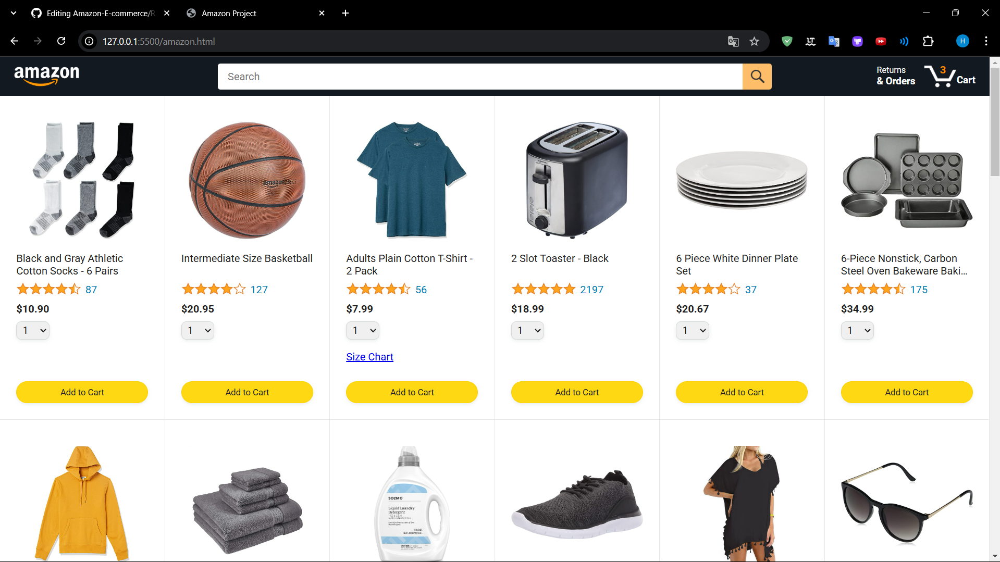
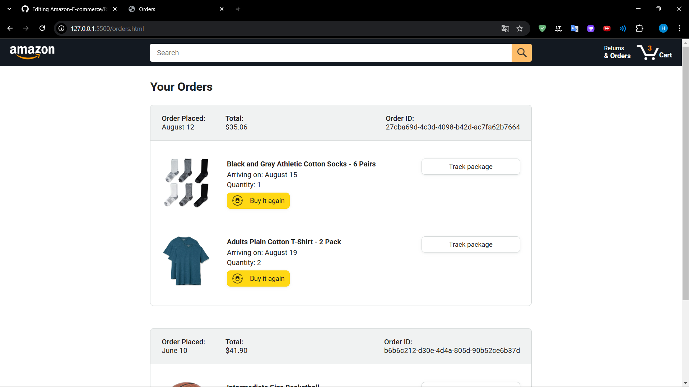
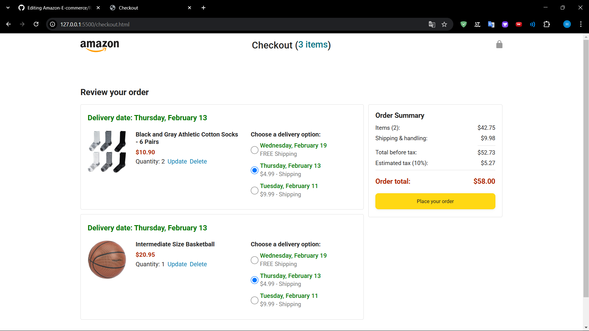

# Amazon Clone

Bu proje, Amazon'un temel işlevselliğini taklit eden bir e-ticaret platformu klonudur.

## 📸 Ekran Görüntüleri

### Ana Sayfa


### Sepet Sayfası


### Sipariş Takip Sayfası



## 🚀 Proje Özellikleri

- **Ürün Listeleme:** Ürünlerin resim, fiyat ve açıklamalarıyla birlikte gösterilmesi.
- **Sepet Yönetimi:** Kullanıcıların ürünleri sepete ekleyip çıkarması.
- **Sipariş Takibi:** Sipariş geçmişi.
- **Responsive Tasarım:** Mobil ve masaüstü cihazlara uyumlu arayüz.

## 🛠 Kullanılan Teknolojiler

- **Frontend:** HTML, CSS, JavaScript
- **Veri Yönetimi:** JSON tabanlı veri saklama
- **Görseller:** PNG, JPG, WebP formatları

## 📦 Kurulum

Proje kodlarını klonlayın:

```sh
git clone https://github.com/kullaniciAdi/amazon-clone.git
cd amazon-clone
```

Tarayıcıda açmak için:

```sh
amazon.html dosyasını tarayıcıda açın
```


## 📌 Yapılacaklar

- ✅ Ürün listeleme ve detay sayfası
- ✅ Sepet yönetimi
- ✅ Sipariş takip sayfası
- 🔲 Kullanıcı giriş/çıkış işlemleri
- 🔲 Ödeme entegrasyonu

---

**📩 İletişim**

Eğer herhangi bir sorunuz veya geri bildiriminiz varsa, benimle iletişime geçmekten çekinmeyin!
